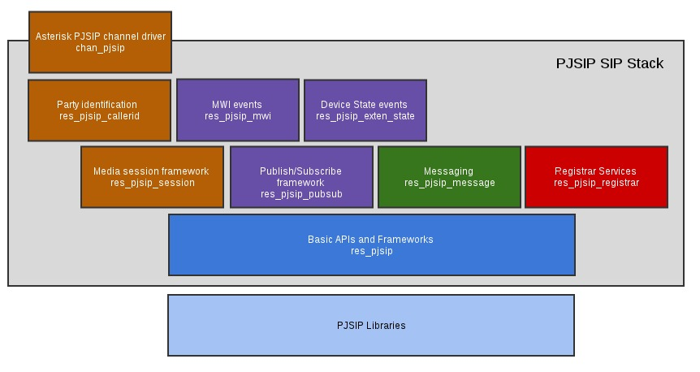

# Архитектура chan\_pjsip

В отличии от chan\_sip который представляет собой монолитный модуль chan\_sip.so . Chan\_pjsip представляет собой стек, состоящий из множества модулей. Каждый из модулей обеспечивает свою часть функций. Это упрощает разработку, отладку. А также обеспечивает более быстрое внедрение новой функциональности.



*  res\_pjsip - Модуль, обеспечивающий базовую функциональность.
*   res\_pjsip\_session - медиа сессии
* res\_pjsip\_messaging - текстовые сообщения
*  res\_pjsip\_registrar - регистрации

Если посмотреть содержимое директорий с модулями астериск то можно увидеть следующее:

```text
$ ls-l | grep sip
chan_sip.so
res_hep_pjsip.so
res_pjsip_acl.so
res_pjsip_authenticator_digest.so
res_pjsip_caller_id.so
res_pjsip_config_wizard.so
res_pjsip_dialog_info_body_generator.so
res_pjsip_diversion.so
res_pjsip_dlg_options.so
res_pjsip_dtmf_info.so
res_pjsip_empty_info.so
res_pjsip_endpoint_identifier_anonymous.so
res_pjsip_endpoint_identifier_ip.so
res_pjsip_endpoint_identifier_user.so
res_pjsip_exten_state.so
res_pjsip_header_funcs.so
res_pjsip_history.so
res_pjsip_logger.so
res_pjsip_messaging.so
res_pjsip_mwi_body_generator.so
res_pjsip_mwi.so
res_pjsip_nat.so
res_pjsip_notify.so
res_pjsip_one_touch_record_info.so
res_pjsip_outbound_authenticator_digest.so
res_pjsip_outbound_publish.so
res_pjsip_outbound_registration.so
res_pjsip_path.so
res_pjsip_phoneprov_provider.so
res_pjsip_pidf_body_generator.so
res_pjsip_pidf_digium_body_supplement.so
res_pjsip_pidf_eyebeam_body_supplement.so
res_pjsip_publish_asterisk.so
res_pjsip_pubsub.so
res_pjsip_refer.so
res_pjsip_registrar.so
res_pjsip_rfc3326.so
res_pjsip_sdp_rtp.so
res_pjsip_send_to_voicemail.so
res_pjsip_session.so
res_pjsip_sips_contact.so
res_pjsip.so
res_pjsip_t38.so
res_pjsip_transport_websocket.so
res_pjsip_xpidf_body_generator.so

```

Таким образом мы видим вместо одного chan\_sip.so множество pjsip\* модулей

