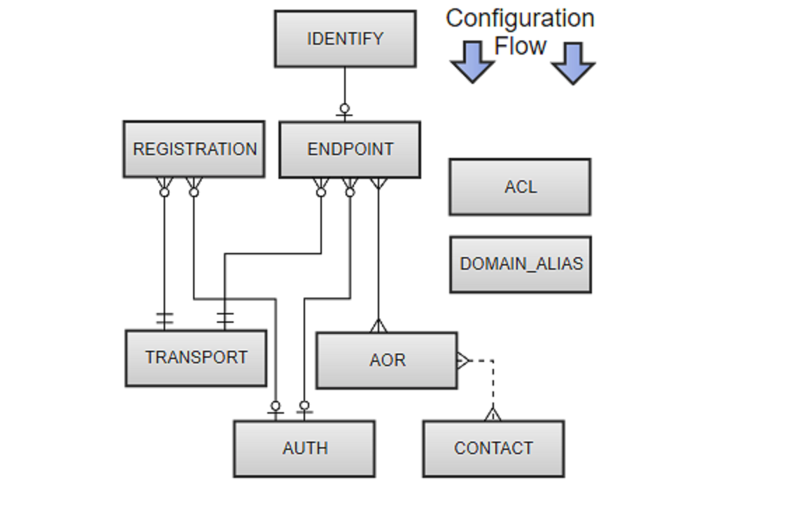

# Конфигурационные сущности PJSIP

Более подробно рассмотрим из чего же состоит конфигурационный файл pjsip.conf

Файл pjsip.conf представляет собой текстовый файл. Он содержит конфигурацию для модуля res\_pjsip и других модулей. Весь файл разбит на секции. Каждая секция содержит в себе набор параметров для конфигурационных объектов \(сущностей\). В общем виде файл имеет следующую структуру: 

```text
[ Имя Секции ] 
КонфигурационнаяОпция = Значение 
КонфигурационнаяОпция = Значение 
```

1.  Имя секции. Указывается квадратных скобках и для многих сущностей может быть любым за исключением некоторых случаев \(эндпоинты \(endpoints\) и АОР \(AOR\) в которых имена имеют значения\). Данные исключения будут рассмотрены далее.
2. Имя опции. Каждая сущность имеет свой набор опций 
3. Значение. Значение опции указывается через знак =.

Прежде всего каждая секция имеет тип. Тип секции указывает на то, какой объект будет конфигурироваться  в данной секции.  

```text
[6001]
type=endpoint
```

 Всего в PJSIP 9 сущностей

1. Endpoints
2. Transport
3. Idenfity
4. Auth
5. AOR
6. Contact
7. Registration
8. Domain\_alias
9. ACL

Практически все сущности взаимосвязаны между собой следующим образом.




Кроме того некоторые объекты могут иметь отношения один ко многим или много ко многим. Так например:

#### Endpoint

*  Множество ENDPOINTs могут иметь  множество AORs
*  Ноль или больше ENDPOINTs имеют ноль или одну AUTHs
*  Ноль или больше ENDPOINTs связаны с как минимум одним TRANSPORT
*  Ноль или одна ENDPOINTs связана с определенной IDENTIFY

####  REGISTRATION

*  Ноль или больше REGISTRATIONs связаны с ноль или одной AUTHs
*  Ноль или больше REGISTRATIONs связаны с как минимум одним TRANSPORT

####  AOR

*  Множество ENDPOINTs связываются с множеством AORs
*  Множество AORs связаны с множеством CONTACTs

####  CONTACT

*  Множество CONTACTs связываются с множеством AORs

####  IDENTIFY

* Ноль или больше ENDPOINTs связаны с определенным IDENTIFY объектом.

Также есть сущности которые не имеют взаимосвязей. Это 

* Domain\_alias
* ACL

Далее каждая сущность будет рассмотрена более подробно  

