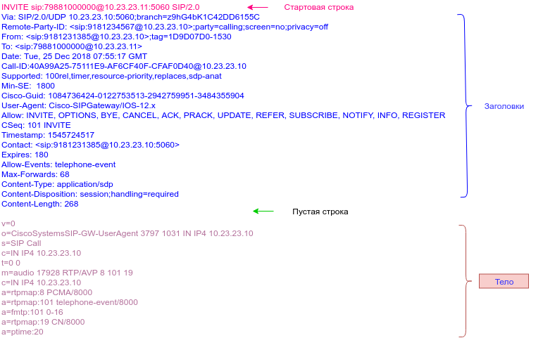
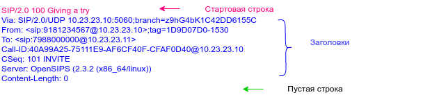
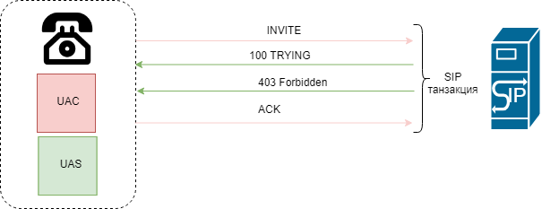
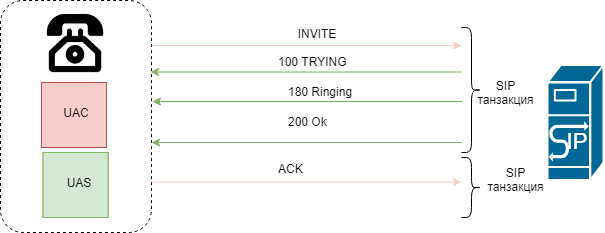
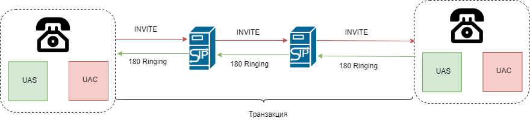
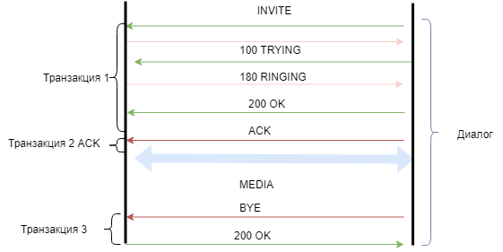

# Основные понятия протокола SIP

## SIP запрос

Протокол SIP представляет собой клиент серверный протокол.  Основу протокола SIP составляют запросы и ответы на них. RFC3261 описывает 6 запросов:

* INVITE
* REGISTER
* BYE
* ACK
* CANCEL
* OPTIONS

### Структура SIP сообщения

 SIP протокол имеет текстовый формат.SIP сообщение состоит из стартовой линии,  нескольких полей называемых заголовками. А также пустой строки, указывающий на конец заголовков.Также сообщение может содержать  тело сообщения.

Стартовая строка, заголовки и пустая строка заканчиваются символом перевода каретки \(CRLF\). Пустая строка должна присутсвовать даже если сообщения не имеет тела. 





В случае запроса стартовая строка называется строкой запроса \(RequestLine\).

RequestLine имеет следующий формат:

_Request-Line = Method SP Request-URI SP SIP-Version CRLF_

_Method -_ Название метода. 

RFC3621 определяет  6 методов 

* INVITE
* REGISTER
* BYE
* ACK.
* CANCEL
* OPTIONS

Дополнительно в различных RFC определены следующие 8 SIP   методов:

* SUBSCRIBE \(RFC6665\)
* NOTIFY\(RFC6665\)
* PUBLISH\(RFC3903\)
* REFFER\(RFC3515\)
* MESSAGE\(RFC3428\)
* PRACK\(RFC3262\)
* UPDATE\(RFC3311\)
* INFO\(RFC3903\)

_SP_ - \(SPACE\) пробел

_SIP-Version -_ текущая версия протокола  _SIP/2.0_

### Request-URI

_Request-URI  -_ это унифицированный  идентификатор ресурса на который отправляется запрос.

URI имеет следующую структуру:

```text
URI = [ схема ":" ] иерархическая-часть [ "?" запрос ] [ "#" фрагмент ]
```

SIP поддерживает несколько URI схем:

* sip
* sips
* tel
* pres
* im
* xmpp
* h323
* http
* https

#### Схемы sip и sips

Основными схемами для протокола sip являются схемы sip и sips. Схема sip и sips следуют правилам описанным в RFC2396 и подобны адресам электронной почты.

Общая форма имеет вид:

```text
sip:user:password@host:port;uri-parameters?headers
```

_user_ - определяет конкретный ресурс на хосте. Под хостом чаще всего понимается домен.

Совокупность user:password + знак "@" называется userinfo и может отсутствовать. Также URI не должен содержать пробелов или переносов строк. Если sip URI содержит \``@`\` ,то значение _user_  не может быть пустым.

_password_   - пароль пользователя. Хотя в RFC не запрещается использовать это поле.  Однако это не рекомендуется, так как пароль будет передан в текстовом виде.

_host_ - FQDN \(полностью определенное имя хоста\), ipv4 или ipv6 адрес. Опционально после : указывается порт.

_port_ - опциональный параметр. Указывается порт на который должен быть послан запрос. Если параметр опущен, то порт определяется используемой схемой:

* 5060 - для sip
* 5061 для sips

#### Параметры URI.

После доменной части \(host:port;\) ; Указываются параметры влияющие на запрос. Если параметров несколько то они указываются через ';'. Один и тот же параметр не может может встречаться несколько раз. Запрос может иметь несколько обязательных параметров в RURI. Общий вид параметров:

```text
parameter-name "=" parameter-value
```

* параметр user определяет то как будет интерпретирована пользовательская \(user\) часть RURI может принимать следующие значения:

  * user=phone

  В этом случае user часть должна быть интерпретирован как телефонный номер. При этом в пользовательской \(user\) части могут быть прописаны дополнительные параметры описанные в RFC2806 для схемы tel.     

  *  user=dialstring


  В этом случае user часть должна быть интерпретирована согласно RFC4967. И является строкой набора номера. В этом случае в user-info могут быть использованы символы: 0-9, A-F, P, X, ’\*’ и ’\#’. При этом E - аналог символа '\*', F - аналог символа '\#', P - это пауза, а X - означает ожидание завершения звонка. При использовании параметра user=dialstring, обязательно должен быть определен параметр  phone-context \(RFC3966\)  Параметр phone-context указывает на область \(домен\) в рамках которой может быть использована данная строка набора. Прокси сервер или B2BUA, обслуживающий данный домен, может, при получении запроса с параметром user=dialsting, преобразовать его в соответствующий телефонный номер. При этом может быть использована схема tel, или sip,sips, с изменением параметра  user на user=phone. Пример Request-URI:

  ```text
  sip:450X123;phone-context=biloxi.example.com@example.com;user=dialstring
  ```

  * user=ip 

  Значение по умолчанию для данного параметра. В этом случае user-info рассматривается как имя пользователя на хосте.


* transport

  Параметр tranport определяет то, какой протокол будет использован для передачи запроса. SIP может использовать любой сетевой транспортный протокол. При использовании sips должен быть использован надежный протокол. Данный параметр не является обязательным. Если данный параметСоответсвенор не указан, то используемый  протокол определяется согласно следующим правилам:

  1.  Если в URI ip адрес указан в числовом виде, то при использовании схемы sip будет использован протокол UDP. При использовании схемы sips будет использован tcp.
  2. Если host указан как доменное имя, но указан порт, то  при использовании схемы sip будет использован протокол UDP. При использовании схемы sips будет использован tcp.
  3. Если не содержится явного указания ip адреса или порта но поддерживаются запросы NAPTR DNS. То для получения хост части URI и используемого протокола, будет использован запрос NAPTR \(RFC2915\).  Пример для UDP:

     ```text
     example.com NAPTR 10 100 "S" "SIP+D2U" "" _sip._udp.example.com.
     ```

     Для протокола tcp:

     ```text
     example.com NAPTR 20 100 "S" "SIP+D2T" "" _sip._tcp.example.com.
     ```

     Список возможных записей:

     * SIPS+D2T - ssip по протоколу tcp
     * SIP+D2T -siСоответсвеноp по протоколу tcp
     * SIPS+D2S - ssip TLS по протоколу sctp
     * SIP+D2S - sip по протоколу scp
     * SIP+D2U sip по протоколу udp

  4.  Если не поддерживается  NAPTR то выполняется запрос SRV \(RFC2782\) Общий формат записи имеет вид:

     ```text
     _Service._Proto.Name TTL Class SRV Priority Weight Port Target
     ```

     Где

     Service = sip

     Proto.Name = udp

     TTL \(время жизни записи в секундах\) 

     Сlass - IN

     Priority -  приоритет записи \(меньше лучше\)

     Weight - вес записи \(больше лучше\)

     Port - порт на котором работает сервис

     Host - хост на котором работает сервис.

     Таким образом для протокола sip на порту 5060 udp запись будет иметь вид

     ```text
     _sip._udp.domain.tld. IN SRV 20 0 5060 mysipproxy.domain.tld.
     ```

  5. Если не найдены SRV записи то будет выполнен DNS запрос А записи и протокол будет определяться схемой: sip - UDP sips - TCP.

* maddr определяет адрес хоста на который будет послан запрос. Соответственно переопределяют  _host._ Обычно используются для указания мультикаст адреса. 
* ttl - Время жизни мультикаст пакета. Обычно равен 1.
* method - служит для указания метода. Значение по умолчанию INVITE. Данный параметр используется в поле Contact запроса REGISTER.

  lr - данный параметр указывает на то что прокси сервер поддерживает loose routing \(RFC3261\). Обычно указывается в заголовках Record-route и Route. Данный параметр был добавлен в RFC3261 c целью обеспечения обратной совместимости с RFC2543, который описывает механизм маршрутизации strict routing.

RFC3261 предполагает что параметры в URI могут расширяться поэтому прокси сервер должен игнорировать те параметры которые он не понимает. Кроме перечисленных параметров, описанных в RFC3261 в различных RFC описаны дополнительные параметры которые могут использоваться в протоколе SIP. Например RFC4240 описывает такие параметры как:

* play
* repeat
* delay
* duration
* locale
* param\[n\]
* target

Которые также могут использоваться в Request-URI.

####   URI Headers

После ? в URI могут быть перечислены заголовки  которые могут быть добавлены в запрос. Аналогично заголовкам Subject и Priority в email.

URI используется во многих заголовках в SIP сообщениях. В таблице приведена схема в которой показана возможная структура URI для различных заголовках в SIP запросе.

 


| элемент | Значение по умолчанию | Request-URI | TO | From | Contact в сообщениях Register/3XX | Contact в Invite и в сообщениях в диалоге  | R-R/Route |
| :--- | :--- | :--- | :--- | :--- | :--- | :--- | :--- |
| user |  | Опция | Опция | Опция | Опция | Опция | Опция |
| password |  | Опция | Опция | Опция | Опция | Опция | Опция |
| host |  | Обязателен | Обязателен | Обязателен | Обязателен | Обязателен | Обязателен |
| port | 5060/5061 | Опция | Запрещено | Запрещено | Опция | Опция | Опция |
| **Параметры** |  |  |  |  |  |  |  |
| user | ip | Опция | Опция | Опция | Опция | Опция | Опция |
| method | INVITE | Запрещено | Запрещено | Запрещено | Запрещено | Запрещено | Запрещено |
| maddr |  | Опция | Запрещено | Запрещено | Опция | Опция | Опция |
| ttl | 1 | Опция | Запрещено | Запрещено | Опция | Запрещено | Запрещено |
| transport | UDP/TCP | Опция | Запрещено | Запрещено | Опция | Опция | Опция |
| lr |  | Опция | Запрещено | Запрещено | Contact: [sip:alice@atlanta.com](mailto:sip:alice@atlanta.com);expires=3600Запрещено | Опция | Опция |
| другие параметры |  | Опция | Опция | Опция | Опция | Опция | Опция |
| Заголовки |  | Запрещено | Запрещено | Запрещено | Запрещено | Опция | Запрещено |

Заметим, что поле contact имеет различные ограничения, в зависимости от того в каких сообщениях используется. Одни ограничения действуют на сообщения создающие или обслуживающие диалог. Другие на сообщения Register или ответы 3XX на любые запросы.

     

### Заголовки

SIP заголовки похожи на http заголовки и имеют формат:

```text
header = "header-name" HCOLON header-value *(COMMA header-value)
```

Где 

* "header-name" - название заголовка. Оно состоит из US-ASCII символов. Название заголовка регистронезависимо. Но принято написание с использованием заглавной и строчных букв.
* HCOLON = \*\( SP   /   HTAB \)   ":"   SWS

или проще говоря  двоеточие с несколькими пробелами или символами табуляции с обои сторон.

Таким образом,  

```text
Subject:            lunch
      Subject      :      lunch
      Subject            :lunch
      Subject: lunch
```

Валидные заголовки. Однако предпочтительной считается запись:


```text
      Subject: lunch
```

Заголовок может состоять из нескольких строк. В этом случае строка должна начинаться с пробела или символа табуляции.: Например эквивалентная запись заголовка Subject:

```text
Subject: I know you're there, pick up the phone and talk to me!
      Subject: I know you're there,
               pick up the phone
               and talk to me!
```

Заголовок может иметь несколько значений в этом случае они разделяются знаком ','  


В один заголовок Contact допускается писать несколько значений разделяя их точкой с запятой, до тех пор пока значение не '\*' 


За некоторым исключением порядок следования заголовков с разными именами не имеет значения. Но рекомендуется чтобы поля необходимые для маршрутизации \(_Via, Route, Record-Route, Proxy-Require,   Max-Forwards, Proxy-Authorization_\) шли в начале сообщения. Это облегчает и ускоряет их обработку.  


Порядок следования заголовков с одинаковыми именами имеет значение.


Например следующая запись заголовков в сообщении равнозначна

 

```text
 Route: <sip:alice@atlanta.com>
      Subject: Lunch
      Route: <sip:bob@biloxi.com>
      Route: <sip:carol@chicago.com>

      Route: <sip:alice@atlanta.com>, <sip:bob@biloxi.com>
      Route: <sip:carol@chicago.com>
      Subject: Lunch

      Subject: Lunch
      Route: <sip:alice@atlanta.com>, <sip:bob@biloxi.com>,
             <sip:carol@chicago.com>
```

 Следующая запись заголовков валидна, но **не равнозначна**: 


```text
 Route: <sip:alice@atlanta.com>
      Route: <sip:bob@biloxi.com>
      Route: <sip:carol@chicago.com>

      Route: <sip:bob@biloxi.com>
      Route: <sip:alice@atlanta.com>
      Route: <sip:carol@chicago.com>

      Route: <sip:alice@atlanta.com>,<sip:carol@chicago.com>,
             <sip:bob@biloxi.com>
```

Формат значений заголовков определяется их именами. При сравнении значений заголовков регистр, если явно не указано иное, не имеет значение. За исключением значений в кавычках. Например одинаковые заголовки:


```text
Contact: <sip:alice@atlanta.com>;expires=3600
CONTACT: <sip:alice@atlanta.com>;ExPiReS=3600
Content-Disposition: session;handling=optional
content-disposition: Session;HANDLING=OPTIONAL
```

 а 


```text
 Warning: 370 devnull "Choose a bigger pipe"
 Warning: 370 devnull "CHOOSE A BIGGER PIPE"
```

Разные заголовки


Токены всегда регистрозависимы.


Для уменьшения размера SIP сообщения, используется сокращенная форма заголовков.

| Загловок | Сокращенная форма |
| :--- | :--- |
| Accept-Contact | a |
| Allow-Event | u |
| Call-ID | i |
| Contact | m |
| Content-Encoding | e |
| SIP/2.0 100 Trying                                                                                                                       Via: SIP/2.0/UDP 185.188.105.210:5060;branch=z9hG4bKa089.8f1652e6.0                                                                      From: "88613320000" &lt;sip:88613320000@185.188.105.210&gt;;tag=as6ba983ce                                                                     To: "79060444915" &lt;sip:79060444915@185.188.105.210&gt;                                                                                      Call-ID: DLGCH\_Sg5KU1xZVl8DV2VTcUIJTlJUW1xWAwM3BXYfWx5UBFsvXg9QegN2QkFLVVBEXV8CX2ECcko-                                                  CSeq: 102 INVITE                                                                                                                         User-Agent: smg\_pa\_sip smg\_pa\_sip-3.10.1.20                                                                                              Content-Length: 0      Content-Length | l |
| Content-Type | c |
| Event | o |
| From | f |
| Identity | y |
| Identity-Info | n |
| Refer-To | r |
| Referred-By | b |
| Reject-Contact | j |
| Request-Disposition | d |
| Session-Expires | x |
| Subject | s |
| Supported | k |
| To | t |
| Via | v |

Краткая запись поля Contact:


```text
m: <sip:alice@atlanta.com>;expires=3600
```

Все заголовки можно разделить на несколько типов:

* Базовые заголовки - Заголовки которые присутствуют в любом SIP сообщении. Данные заголовки являются базовыми, потому что обеспечивают основную функциональность протокола SIP:  адресацию сообщений, их маршрутизацию, предотвращение петель, ограничение распространения сообщений,  сохранение очередности сообщений и их идентификацию. К таким заголовкам относятся:

  * Via
  * To
  * From
  * CSeq
  * Call-Id
  * Max-Forwards

* Заголовки запросов - Заголовки которые могут присутсвовать только в SIP запросах. К таким заголовкам относится например Require, Subject, Authorization
* Заголовки ответов - Заголовки которые присутствуют только в ответе на SIP запрос. К таким относятся: WWW-Authenticate, Unsupported.
* Заголовки тела сообщения - заголовки которые относятся к телу SIP сообщения к таким относятся: Content-Length, Content-Type, Content-Encoding, Content-Language.

 Таким образом любой SIP запрос должен иметь вид:

```text
Стартовая строка<CRLF>
VIA<CRLF>
Max-Forwards<CRLF>
From<CRLF>
To<CRLF>
Call-Id<CRLF>
CSeq<CRLF>
Пустая строка<CRLF> 
```

## SIP ответы

SIP ответ - это сообщение генерируемое  сервером агента пользователя \(UAS\) или прокси сервером, в ответ на SIP запрос. Основным отличием SIP ответа от SIP запроса является наличие строки состояния \(Status-Line\) в стартовой строке. Строка состояния имеет следующую структуру:

```text
Status-Line  =  SIP-Version SP Status-Code SP Reason-Phrase CRLF
```

 

* SIP-Version -  SIP/2.0 текущая версия протокола
*  SP - пробел
* Status-Code - Код ответа. Числовой код ответа.
* Reason-Phrase  - Краткое описание кода ответа. Данное поле может содержать произвольную информацию

```text
SIP/2.0 100 Trying                                                                                                                      
Via: SIP/2.0/UDP 10.10.10.21:5060;branch=z9hG4bKa089.8f1652e6.0                                                                     
From: "81111111111" <sip:8811111111@10.10.10.21>;tag=as6ba983ce                                                                    
To: "7222222222" <sip:7222222222@10.10.10.21>                                                                                     
Call-ID: DLGCH_Sg5KU1xZVl8DV2VTcUIJTlJUW1xWAwM3BXYfWx5UBFsvXg9QegN2QkFLVVBEXV8CX2ECcko-                                                 
CSeq: 102 INVITE                                                                                                                        
User-Agent: smg_pa_sip smg_pa_sip-3.10.1.20                                                                                             
Content-Length: 0     
```

  
Общий формат SIP ответа:

```text
Status-Line
VIA<CRLF>
Max-Forwards<CRLF>
From<CRLF>
To<CRLF>
Call-Id<CRLF>
CSeq<CRLF>
Пустая строка<CRLF> 
```

Основное значение имеет Status-Code. В зависимости от кода все ответы делятся на классы. Пять классов аналогичны http а 6 введен специально для SIP. Ответы могут содержать дополнительные заголовки.

| Класс | Описание | Действие |
| :--- | :--- | :--- |
| 1XX | Информационные | Показывает состояние вызова во время установления соединения.  Также их называют предварительными ответами. |
| 2XX | Успешные | Ответы класса 2XX означают, что вызов был успешно обработан  |
| 3XX | Перенаправления | Информирует о необходимости перенаправления вызова в новое местоположение. |
| 4XX | Ошибка в запросе | Информирует о том что в запросе содержится ошибка. Клиент не  должен повторять тот же запрос без его модификации. |
| 5XX | Отказ сервера | Ответы не могут быть выполнены из за ошибки сервера. Запрос может быть  перенаправлен на другой сервер. Или повторен позднее. |
| 6XX | Глобальная ошибка | Соединение установить не возможно ни на одном сервере. Запрос не должен посылаться на другой сервер |

  
Если сервер не может распознать полный ответ, то он должен ориентироваться на класс ответа. Например ответ 599 должен быть обработан как 500.

Ответы 1xx называются предварительными , а 2xx-6xx окончательные. 


  

## SIP Транзакция.

SIP протокол многоуровневый протокол. Нижний уровень протокола отвечает за кодирование сообщений. Второй уровень является транспортным. Третий уровень протокола SIP называется уровнем транзакций. Выше уровня транзакций находиться уровень, называемый _пользователем транзакций_ \(transaction user, TU\). Все компоненты SIP сети, за исключением stateless  proxy работают на уровне пользователя транзакций .

 Взаимодействие между клиентом и сервером осуществляется с помощью периодического обмена порциями сообщений. 

SIP транзакция включает себя последовательность сообщений между UAC и UAS начиная от Запроса и заканчивая окончательным ответом \(не 1xx\).

Via: SIP/2.0/UDP 185.128.105.210:5060;branch=z9hG4bKa089.8f1652e6.0                                                                       




Таким образом, SIP транзакция включает в себя запрос ни одного или несколько предварительных ответов и финальный ответ.



**Есть особое уточнение относительно запроса ACK. Если ACK отправляется в качестве подтверждения ответа  200 ОК, то он не является частью транзакции. В случае, если АСК отправляется   в качестве подтверждения ответа, отличного от 200 ОК то он является частью транзакции.  Согласно RFC причина этого в том, что на UAS возлагается ответственность  за повторную передачу ответа 200 Ок, в случае если  UAC не подтвердил получение ответа с помощью ACK.**




-

Все транзакции имеют клиентскую и серверную сторону. Клиентская сторона называется клиентской транзакцией, а серверная сторона соответственно серверной транзакцией.

Клиентская сторона занимается отправкой запросов, а серверная сторона отвечает за отправку ответов. Они создаются между UA и statefull прокси.


   


В случае stateless proxy транзакция существует только с между  двумя UA. Stateless прокси сервер е генерирует ни каких предварительных ответов. Он пересылает запрос дальше.  Когда запрос достигает UA, то он используя UAS часть генерирует ответ и отсылает его вызывающему UA,используя заголовки VIA. 


 



 Идентификатором транзакции в SIP сообщении служит параметр **branch** заголовка VIA

```text
Via: SIP/2.0/UDP 185.128.105.210:5060;branch=z9hG4bKa089.8f1652e6.0                                                                     
```

Обратите внимание на последовательность **z9hG4bK,** с которой чаще всего и начинается параметр  brunch. Данная последовательность означает то что запрос был сгенерирован клиентом, поддерживающим RFC 3261 и параметр уникален для каждой транзакции этого клиента.

Ниже приведены дампы SIP пакетов для различных случаев.


## SIP диалог

_SIP диалог_ это равноправное peer to peer взаимодействие между между двумя UA которое длиться некоторое время.

Диалог устанавливает последовательность сообщений между двумя UA и отвечает за их правильную маршрутизацию.

Диалог идентифицируются UA по заголовку Call-ID, а также по параметрам tag в полях To и From. 

  В RFC3261 определен только один метод устанавливающий диалог это INVITE. 



 Таким образом каждый диалог содержит транзакцию, которая его создает, может содержать транзакцию которая его изменяет. А также транзакцию которая его завершает.

  


