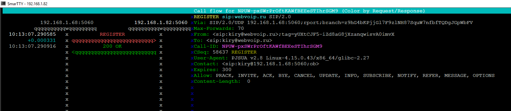
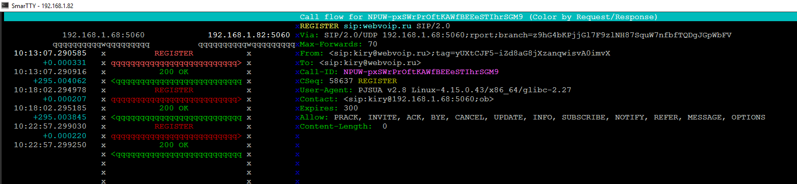

# Запрос Register

Как уже говорилось протокол SIP подразумевает возможность перемещения пользователя в сети. Для того чтобы установить сессию с пользователем proxy server при получении INVITE обращается к серверу определения местоположения \(location server\), который возвращает один или несколько адресов, связанных с текущим местоположением пользователя. В конечном счете proxy сервер узнает адрес UA или нескольких UA, где в текущее время доступен пользователь. Это несколько не привычно, для людей знакомых со традиционной телефонией, где за абонентом был закреплен конкретный номер, и в конечном итоге конкретный телефонный аппарат.

Для того чтобы сообщить серверу местоположения, свой текущий адрес UA выполняет специальный запрос _REGISTER_. А сама процедура внесения изменений в базе сервера местоположения путем выполнения запроса _REGISTER_,  называется _регистрацией._

Cервер обрабатывающий запросы  _REGISTER_ называется сервером регистраций.  

Итак для того чтобы зарегистрировать свое текущее местоположение UA выполняет запрос REGISTER. C помощью запроса REGISTER UA может выполнить следующие действия:

* связать публичный адрес \(Address of Record\) с одним или несколькими текущими адресами пользователя \(contact\).
* удалить предыдущие связки AOR Contact.
* запросить текущие связки AOR Contact

Нужно отметить что регистрация нужна только для входящих звонков. Для осуществления исходящей связи регистрация не требуется.

### Структура запроса

Запрос REGISTER содержит следующие обязательные заголовки:

| REQUEST-URI |
| :--- |
| VIA |
| TO |
| FROM |
| Call-ID |
| CSeq |
| Contact |
| Max-Forwards |

#### REQUEST-URI

Поле REQUEST-URI содержит домен в котором собирается зарегистрироваться пользователь например webvoip.ru. В отличие от других SIP запросов поле REQUEST-URI запроса Register не содержит пользовательской части \(user-info\) и знака @.

#### To

Поле To запроса Register содержит AOR \(публичный адрес\) для которого выполняется запрос REGISTER. Поле TO отличается от REQUEST-URI тем, что поле TO содержит имя пользователя.

#### From

Поле FROM содержит AOR \(публичный адрес\) UA который выполняет регистрацию. Данный заголовок обычно совпадает с  полем TO, за исключением того когда регистрацию выполняет не UA конечного пользователя, а третья сторона \(third- party registration\).

####  Call-Id

Все сообщения REGISTER от UAC должны использовать единое значение Call-Id при отсылке запросов на соответствующий registrar.

#### Cseq

Заголовок Cseq обеспечивает верную последовательность запросов REGISTER. UAC увеличивает значение CSeq на 1 для каждого запроса c одинаковым Call-Id.

#### Contact

Заголовок Contact может содержать один или несколько адресов пользователя, которые должны быть связаны с AOR  \( публичным адресом \) . UAC не должен отсылать ни какие новые запросы регистрации \(запрос REGISTER c новым полем Contact\), до тех пор, пока не получит окончательный ответ на предыдущий запрос REGISTER, или пока не истечет время ожидания предыдущего запроса REGISTER.

Поле contact обычно содержит sip или sips URI, но может использовать любую схему URI например tel или mail-to. Если поле TO запроса содержит SIPS URI то и остальные поля должны содержать SIPS URI.

Поле Contact может содержать параметры. Параметры action и expire имеют особое значение.

#### Параметр expire

Параметр expire устанавливает время существования \(в секундах\) связки между AOR и Contact, которая образуется в результате обработки сервером регистраций запроса REGISTER. Данное значение может принимать значение от 0 до 2^32 степени или 4294967295 сек\). Если заголовок Contact не содержит данного параметра, то берется значение указанное в заголовке Expire.

Если запрос Register не содержит ни параметра expire в поле Contact, ни заголовка Expire или их значения некорректны, то registrar должен использовать значение по умолчанию. Значение по умолчанию составляет 3600 сек. Однако время жизни регистрации, в конечном итоге определяется сервером регистраций.

#### Параметр action

Параметр action в RFC 3261 считается устаревшим и не должен использоваться.

#### Параметр q

Запрос REGISTER может содержать больше одного адреса в поле Contact. Это означает, что все эти адреса должны быть связаны с одним AOR \(публичным адресом\) указанным в заголовке To .

С помощью параметра q можно задать относительный приоритет одного адреса \(contact\) перед другим.

```text
Contact:<sip:40668610656@62.206.3.10:5060;user=phone>;q=0.5,<sip:40668610656@212.105.2
16.10:5060;user=phone>;q=0.25 
```

###  Процедура регистрации.

Как уже говорилось, для регистрации UAC формирует запрос REGISTER. И посылает его на registar \(или на прокси сервер который уже пересылает его на registrar \). В ответ на запрос REGISTER, в случае успешной регистрации UA получает ответ 200 OK.  

####   Поиск сервера регистрации.

Выбор сервера регистрации. Registrar сервер может быть определен 3-мя способами:

* Задан в конфигурации UA.
* Если адрес сервера регистраций не сконфигурирован, то UA должен использовать доменную часть AOR \(поля TO\).
* UA может быть сконфигурирован на использование широковещательных адресов. В этом случае запросы посылаются на специально выделенный адрес  224.0.1.75.

####  

Ниже представлен обмен SIP сообщениями между UA и сервером регистраций:



                                                                                                                            

```text
REGISTER sip:webvoip.ru SIP/2.0                                                                                                                                                                      
Via: SIP/2.0/UDP 192.168.1.68:5060;rport;branch=z9hG4bKPjjGl7F9zlNH87SquW7nfbfTQDgJGpWbFV                                                                                                            
Max-Forwards: 70                                                                                                                                                                                     
From: <sip:kiry@webvoip.ru>;tag=yUXtCJF5-iZd8aG8jXzanqwisvA0imvX                                                                                                                                     
To: <sip:kiry@webvoip.ru>                                                                                                                                                                            
Call-ID: NPUW-pxSWrPrOftKAWfBEEeSTIhrSGM9                                                                                                                                                            
CSeq: 58637 REGISTER                                                                                                                                                                                 
User-Agent: PJSUA v2.8 Linux-4.15.0.43/x86_64/glibc-2.27                                                                                                                                             
Contact: <sip:kiry@192.168.1.68:5060;ob>                                                                                                                                                             
Expires: 300                                                                                                                                                                                         
Allow: PRACK, INVITE, ACK, BYE, CANCEL, UPDATE, INFO, SUBSCRIBE, NOTIFY, REFER, MESSAGE, OPTIONS                                                                                                     
Content-Length:  0                                                                                                                                                                                   
                                         
```

###  

```text
SIP/2.0 200 OK                                                                                                                                                                                       
Via: SIP/2.0/UDP 192.168.1.68:5060;received=192.168.1.68;rport=5060;branch=z9hG4bKPjjGl7F9zlNH87SquW7nfbfTQDgJGpWbFV                                                                                 
From: <sip:kiry@webvoip.ru>;tag=yUXtCJF5-iZd8aG8jXzanqwisvA0imvX                                                                                                                                     
To: <sip:kiry@webvoip.ru>;tag=82bcf4659134185c916f073fe5b49956.0db5                                                                                                                                  
Call-ID: NPUW-pxSWrPrOftKAWfBEEeSTIhrSGM9                                                                                                                                                            
CSeq: 58637 REGISTER                                                                                                                                                                                 
Contact: <sip:kiry@192.168.1.68:5060;ob>;expires=300                                                                                                                                                 
Server: OpenSIPS (2.4.4 (x86_64/linux))                                                                                                                                                              
Content-Length: 0  
```

Как уже и говорилось  поле 

```text
Call-ID: NPUW-pxSWrPrOftKAWfBEEeSTIhrSGM9
```

одинаково для всех запросов.

При этом в базе данных на сервере регистраций \(в данном примере используется OPENSIPS\) будет следующая запись:

```text
AOR:: kiry
                Contact:: sip:kiry@192.168.1.68:5060;ob Q=
                        ContactID:: 1399423215461226045
                        Expires:: 296
                        Callid:: NPUW-pxSWrPrOftKAWfBEEeSTIhrSGM9
                        Cseq:: 58656
                        User-agent:: PJSUA v2.8 Linux-4.15.0.43/x86_64/glibc-2.27
                        State:: CS_NEW
                        Flags:: 0
                        Cflags:: 
                        Socket:: udp:192.168.1.82:5060
                        Methods:: 8063
```

### Обновление регистрации



